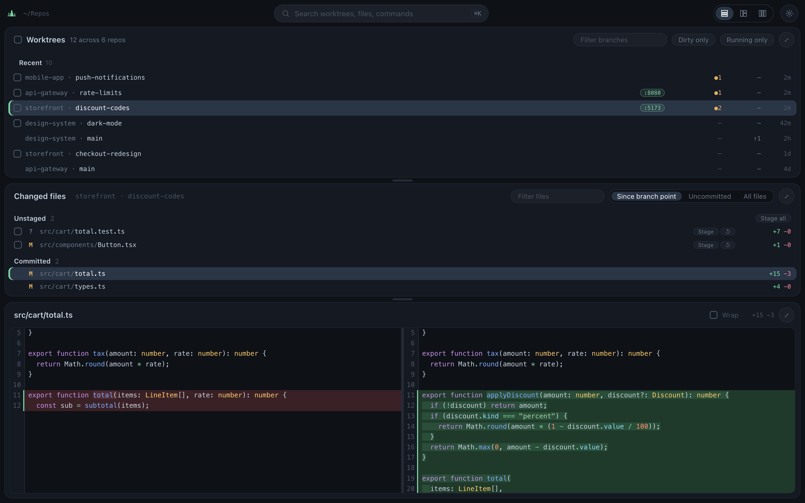

# forest

A dashboard for git worktrees across every repo in one directory. Scans a root
folder, finds each repo and its worktrees, and shows what's dirty, what's ahead
or behind, which has an open PR, and which is running a dev server right now —
with a built-in diff viewer you can stage, discard, and edit from.

Deno server + Svelte frontend. No database, no config to write by hand.



## Quick start

macOS only for now (it reads `lsof` and macOS app paths). Needs Deno 2, Node
20.19+ (for Vite 7), and git. PR badges also need the `gh` CLI, authenticated
(`gh auth login`) — without it, Forest runs with PR badges off and says why in a
notice under the title bar.

```sh
git clone https://github.com/JakeAve/forest.git && cd forest
deno task start --open
```

`start` installs frontend deps, builds `dist/`, starts the server on
http://forest-app.localhost:38471, and with `--open` opens it in your browser.
Leave it running in a terminal; Ctrl-C stops it. Re-run it after pulling.

Set `root` to the directory your repos live in — whatever that is on your
machine — via the ⚙ settings panel, or write it directly:

```sh
mkdir -p ~/.forest && echo '{"root":"~/your-repos-dir"}' > ~/.forest/settings.json
```

A leading `~` is expanded. The path is scanned one level deep: every immediate
subdirectory containing a `.git` counts as a repo.

Settings marked "restart" in the [table below](#settings) need one; everything
else applies live. `watch` is the one setting the settings panel can't toggle —
edit the file.

## What it shows

Each worktree row carries its branch, dirty-file count, ahead/behind arrows,
listening ports (linked, click to open), open PR number, and last activity —
where activity means the newest of the HEAD commit and the mtime of any changed
or untracked file, so a worktree you're editing sorts to the top before you
commit anything.

The Recent group holds the most recently active worktrees; pin one from its
right-click menu to keep it there. Fuzzy-filter by branch or repo name (`dc`
finds `discount-codes`), or narrow to dirty-only / running-only.

Right-click a worktree to open it, copy its path or branch, view or create its
PR, push, rebase onto `origin/HEAD`, update the branch, enable auto-merge, mark
a PR draft or ready, close it, kill a process listening in it, turn on
auto-rebase, or remove the worktree. Select several to copy or remove them
together. Right-click a repo for new worktree.

Auto-rebase keeps a worktree current with `origin/HEAD` on a timer
(`autoRebaseMs`). A branch with an open PR is updated on GitHub, the same
merge-from-base as the card's update-branch button, and fast-forwarded locally
once that lands; any other branch is rebased locally and never pushed. A dirty
worktree, one mid-rebase or -merge, or one with unpushed commits is left alone
for that tick. A failed attempt shows as a red ↻ on the row with the error as
its tooltip, and isn't retried until `origin/HEAD` moves again. The set of
worktrees lives in `~/.forest/autorebase.json`.

Selecting a worktree lists its changed files, either since the branch point
(merge-base with `origin/HEAD`) or just uncommitted. Selecting a file opens a
CodeMirror diff you can stage or discard by hunk, edit in place, and save —
saves are guarded by a compare-and-swap against what was on disk, so a
concurrent write returns 409 instead of clobbering.

Switch the files band to **all files** to browse every file as a tree;
gitignored files and folders are dimmed, and an ignored folder lists its
contents one level at a time as you expand it. Dependency and cache folders
(`node_modules`, `.venv`, `target`, `vendor`, …) are treated the same even when
nothing ignores them, and temporary roots never walk into them. Changed files
keep their status letter. Files open in a single editable pane, with a view/diff
toggle when they have changes. Binary files and anything over 1 MB show a stub
instead. Right-click any file for its relative or absolute path, or press ⌥⇧⌘C /
⌥⌘C for the open one.

Port detection reads `lsof` and maps listening PIDs to their cwd, then to the
owning worktree. PRs come from `gh pr list`, so PR badges need the `gh` CLI
authenticated; everything else works without it. Hover (or focus) a PR badge for
its card, filled by one GraphQL query per open PR: merge state with an
update-branch button and auto-merge checkbox, reviewers who have responded
(pending requests collapsed), unresolved code threads with the rest collapsed,
comments (collapsed), and checks with run time and finish time, optional ones
collapsed. Every review, thread, comment and check links to GitHub.

⌘O (or clicking the path in the Files header) turns it into a path box for
opening anything: absolute paths, `~/…`, a trailing `/`, `path:line` /
`path:line:col`, `file://` URLs, quoted paths, and relative paths (resolved
against the selected worktree or folder). A path inside a scanned worktree
selects that worktree in all-files mode with the file opened and scrolled to the
line, or the folder expanded. Anything else — a file or folder outside every
scanned repo, e.g. in `~/Downloads` — opens as a temporary root: the files pane
lists that folder (a file's parent, with the file selected), capped at 5000
files. No git features there, but editing and ⌘S work. Temporary roots last
until the server restarts.

The layout buttons in the title bar arrange the three panes as a stack, a
worktree sidebar beside files over source, or three columns. Each layout keeps
its own sizes; drag the gaps between panes (or focus one and use the arrow keys)
to resize, and double-click a gap between stacked panes to collapse the one
above.

⌘K or ⌘P opens the command palette from anywhere, the editor included. It
fuzzy-searches worktrees, repos, and the selected worktree's folders and files,
plus commands (settings, layout, pane maximize, file modes, wrap, filters,
theme) and the selected worktree's context-menu actions. "Filter branches…" and
"Filter files…" drive the pane filters live from the palette, listing the best
matches first. "Grep…" searches file contents (case-insensitive, gitignored
files skipped) and opens a hit at its line. Start the query with `>` to see only
commands and actions. Tab or → drills into an item's actions (a worktree's or
repo's context menu, the theme list); ← or Backspace on an empty query goes
back.

## Agents

The daemon exposes the same data read-only to agents, over plain
`GET /api/t/<name>?k=v` and over MCP at `/mcp`. Nothing here writes; a `wt` is
any unique substring of a branch or repo name (or a full path), and an ambiguous
one comes back as an error listing the candidates (a 400 over `/api/t/`, a tool
error over MCP). `wt` also accepts any path inside a worktree, `~/…` included.
`q` is looser: it fuzzy-matches like the UI filters (branch and repo name for
`wts`, file path for `files`).

| tool       | params                                  | returns                    |
| ---------- | --------------------------------------- | -------------------------- |
| `snapshot` | —                                       | every repo, with worktrees |
| `wts`      | `q`, `dirty`, `running`, `pr`, `recent` | worktrees, newest first    |
| `whoami`   | `path`                                  | the worktree owning a path |
| `files`    | `wt`, `q`, `base=branch\|head`          | changed files              |
| `link`     | `wt`, `file`, `line`, `base`            | `{ url }`                  |

That URL is the deep-link contract, and it works typed by hand too:
`/?wt=<path>&file=<path>&line=<n>&base=branch|head&tree=1` opens the worktree,
selects the file, and scrolls to the line; `tree=1` opens it in the all-files
view. A temporary root (see ⌘O above) uses `?path=<folder>&file=<rel>&line=<n>`
instead of `wt`.

```sh
curl -s 'forest-server.localhost:38471/api/t/wts?q=1234&recent=3'
claude mcp add --transport http forest http://forest-server.localhost:38471/mcp
```

`*.localhost` resolves to loopback with no setup. Existing installs re-run
`claude mcp remove forest` before the add above.

## Settings

Stored at `~/.forest/settings.json` — only values that differ from the defaults
are written.

| key                 | default     |                                                                  |
| ------------------- | ----------- | ---------------------------------------------------------------- |
| `port`              | `38471`     | server port (restart)                                            |
| `host`              | `127.0.0.1` | address the server binds (restart)                               |
| `root`              | `~/Repos`   | directory scanned for repos (restart)                            |
| `pollMs`            | `5000`      | rescan tick; with `watch` on, ports and PRs only                 |
| `prPollMs`          | `60000`     | PR refresh for a repo with an open PR                            |
| `prIdleMs`          | `300000`    | PR refresh for a repo without one                                |
| `autoRebaseMs`      | `300000`    | how often auto-rebase worktrees follow `origin/HEAD`             |
| `watch`             | `true`      | recompute on file events instead of polling (restart to turn on) |
| `watchDebounceMs`   | `300`       | quiet time after an event before recomputing                     |
| `watchMaxWaitMs`    | `2000`      | longest a steady event stream defers a recompute                 |
| `watchSweepMs`      | `300000`    | full rescan anyway, in case events were dropped                  |
| `watchHotThreshold` | `10`        | recomputes per minute before a repo backs off                    |
| `watchBackoffMaxMs` | `30000`     | longest backoff for a hot repo                                   |
| `watchStormRate`    | `2000`      | events/sec past which forest falls back to polling               |
| `recentCount`       | `10`        | rows in the Recent group                                         |
| `agoRefreshMs`      | `30000`     | how often relative times re-render                               |
| `toastMs`           | `7000`      | toast lifetime                                                   |
| `collapseMargin`    | `3`         | context lines kept around a hunk                                 |
| `collapseMinSize`   | `5`         | shortest run of unchanged lines that collapses                   |
| `launchers`         | `{}`        | per-repo worktree-creation commands                              |

`host` defaults to loopback for a reason: setting it to `0.0.0.0` serves your
repositories unauthenticated to everything on the LAN, including file contents
and every UI action (save, discard, push, close PR, remove worktree). `/mcp`
checks that the `Host` header is localhost or `forest-server.localhost`, which
stops DNS rebinding from a browser but not a LAN client that sends that header
itself. Opening a path outside every scanned repo (⌘O, above) only answers
requests from this machine — a loopback address and a `Host` of `localhost`,
`127.0.0.1`, `[::1]` or `forest-app.localhost` — even when `host` is `0.0.0.0`.

### Launchers

By default, "new worktree" runs `git worktree add <repo>-wt/<slug> -b <slug>`.
If a repo needs setup beyond that — copying an `.env`, installing deps — give it
a command template. Tokens `{slug}`, `{repo}`, `{path}`, `{root}` are
substituted; `*` is the fallback for repos without their own entry.

```json
{ "launchers": { "*": "./scripts/new-worktree.sh {slug}" } }
```

## Themes

Ships a default dark theme and imports any VS Code color theme — either a JSON
file you pick, or one VS Code already has installed (it scans VS Code, Insiders,
VSCodium, and Cursor extension dirs). Imported themes land in
`~/.forest/themes/`. Contrast is derived rather than trusted, so a theme whose
accent vanishes against its own background gets a readable fallback instead.

## Development

```sh
deno task serve   # server on :38471, restarts on .ts changes
npm run dev       # in a second terminal: http://forest-app.localhost:38472 with HMR, proxies /api
```

`deno task serve` alone serves the last `dist/` build; it warns if there isn't
one.

```sh
deno task check   # fmt + lint + typecheck
deno task test    # unit tests, no network or fixtures
deno task setup   # wire .githooks (check + test on commit and push)
```

Parsing is deliberately split out of `main.ts` into `parse.ts`, `src/theme.js`,
and `src/filter.js` — that's the part with edge cases worth testing, and it's
testable without spawning git. The rest of the server is split into per-system
modules (`exec`, `repo`, `prs`, `ports`, `store`, `sse`, `watcher`, `files`,
`themes`, `log`, `tools`, `routes`, `stats`, `settings`, `types`), each with its
own `<module>_test.ts`.

## Desktop app

```sh
deno task desktop   # builds Forest.app via `deno desktop`
```

Same server, wrapped in a native window with a transparent titlebar. Cmd +/-/0
zoom only in that build.

Opened from Finder or the Dock, an app gets launchd's bare PATH rather than your
shell's, so the desktop build reads PATH from your login shell (`$SHELL -il`) at
startup; `gh`, launchers, and repo git hooks then find the same tools a terminal
would.
