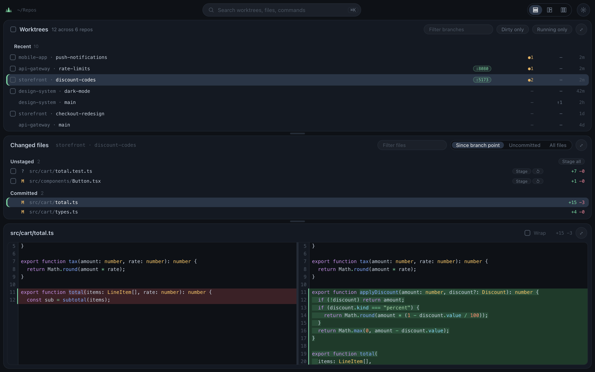

# forest

A dashboard for git worktrees across every repo in one directory. Scans a root
folder, finds each repo and its worktrees, and shows what's dirty, what's ahead
or behind, which has an open PR, and which is running a dev server right now —
with a built-in diff viewer you can stage, discard, and edit from.

Deno server + Svelte frontend. No database, no config to write by hand.



## Quick start

macOS only for now (it reads `lsof` and macOS app paths). Needs Deno 2, Node
20.19+ (for Vite 7), and git. PR badges also need the `gh` CLI, authenticated
(`gh auth login`) — without it, Forest runs with PR badges off and says why in a
notice under the title bar.

```sh
git clone https://github.com/JakeAve/forest.git && cd forest
deno task start --open
```

`start` installs frontend deps, builds `dist/`, starts the server on
http://forest-app.localhost:38471, and with `--open` opens it in your browser.
Leave it running in a terminal; Ctrl-C stops it. Re-run it after pulling.

Set `root` to the directory your repos live in — whatever that is on your
machine — via the ⚙ settings panel, or write it directly:

```sh
mkdir -p ~/.forest && echo '{"root":"~/your-repos-dir"}' > ~/.forest/settings.json
```

A leading `~` is expanded. The path is scanned one level deep: every immediate
subdirectory containing a `.git` counts as a repo.

Settings marked "restart" in the [table below](#settings) need one; everything
else applies live. `watch` is the one setting the settings panel can't toggle —
edit the file.

## What it shows

Each worktree row reads, under a header of column labels: branch, PR title,
ticket, PR number with its status word and age (`#812 needs review 30m`),
dirty-file count, ahead/behind arrows, the first listening port (linked, click
to open) with `+n` for the rest (click it to open any of them), the coding agent
badge, and last activity. Zero counts stay blank, and a merged or closed PR dims
its whole row. Right-click the header row to show or hide columns, drag a header
to reorder, or use the Columns section in ⚙. Activity means the newest of the
HEAD commit and the mtime of any changed or untracked file, so a worktree you're
editing sorts to the top before you commit anything.

Pinned, Recent and All worktrees are collapsible containers, and each repo nests
under All. Recent holds the most recently active worktrees; pin one from its
right-click menu to keep it in Pinned. A worktree shown in Pinned or Recent is
not repeated under its repo, and a collapsed container shows its count and a
summary of PRs that need attention (`25 · 1 failing`). Fuzzy-filter by branch or
repo name (`dc` finds `discount-codes`), or narrow to dirty-only / running-only.

Right-click a worktree to open it, copy its path or branch, view or create its
PR, push, rebase onto `origin/HEAD`, update the branch, enable auto-merge, mark
a PR draft or ready, close it, kill a process listening in it, turn on
auto-rebase, or remove the worktree. Select several to copy or remove them
together. Right-click a repo for new worktree. Hover a row for its checkbox, or
⌘-click, ⇧-click, or press Space to add it to the selection.

A badge on the row names the coding agent session that created the worktree.
Forest finds it by reading agent transcripts (`~/.claude/projects`,
`~/.codex/sessions`) for the earliest mention of the worktree's path (a main
checkout on a feature branch instead matches sessions that ran in it on that
branch, `cd`'d or `git -C`'d into it, or mention its ticket key); a count on the
badge means several sessions worked inside it. Click the badge to list every
session that mentions the worktree, most likely creator first, and pick one to
open it in its desktop app (`claude://resume`, `codex://threads/`); right-click
resumes the most likely one directly. A session's › (or right-click, or →) swaps
the list for its actions: open in its app, resume in Terminal (`claude --resume`
/ `codex resume` in the directory it started in), copy its ID or its resume
link. Keys: `a` opens the selected worktree's list and ⌥⌘A resumes its most
likely session; in the list `↑`/`↓` (or whatever moves between worktrees) step,
`↩` opens, `→`/`←` enter and leave a session's actions, and `t`, `c`, `l` resume
in terminal, copy the ID, copy the link. They're rebindable under Agent sessions
in the shortcuts overlay. Another agent is one entry in `PROVIDERS` in
`agents.ts`.

Auto-rebase keeps a worktree current with `origin/HEAD` on a timer
(`autoRebaseMs`). A branch with an open PR is updated on GitHub, the same
merge-from-base as the card's update-branch button, and fast-forwarded locally
once that lands; any other branch is rebased locally and never pushed. A dirty
worktree, one mid-rebase or -merge, or one with unpushed commits is left alone
for that tick. A failed attempt shows as a red ↻ on the row with the error as
its tooltip, and isn't retried until `origin/HEAD` moves again. The set of
worktrees lives in `~/.forest/autorebase.json`.

Selecting a worktree lists its changed files, either since the branch point
(merge-base with `origin/HEAD`) or just uncommitted. Selecting a file opens a
CodeMirror diff you can stage or discard by hunk, edit in place, and save —
saves are guarded by a compare-and-swap against what was on disk, so a
concurrent write returns 409 instead of clobbering.

Switch the files band to **all files** to browse every file as a tree;
gitignored files and folders are dimmed, and an ignored folder lists its
contents one level at a time as you expand it. Dependency and cache folders
(`node_modules`, `.venv`, `target`, `vendor`, …) are treated the same even when
nothing ignores them, and temporary roots never walk into them. Changed files
keep their status letter. Files open in a single editable pane, with a view/diff
toggle when they have changes. Binary files and anything over 1 MB show a stub
instead. Right-click any file for its relative or absolute path, or press ⌥⇧⌘C /
⌥⌘C for the open one.

Port detection reads `lsof` and maps listening PIDs to their cwd, then to the
owning worktree. PRs come from `gh pr list`, so PR badges need the `gh` CLI
authenticated; everything else works without it. Click a PR badge (or press `p`)
for its card (⌘-click opens the PR on GitHub). The card is filled by one GraphQL
query per open PR: merge state with an update-branch button and auto-merge
checkbox, reviewers who have responded (pending requests collapsed), unresolved
code threads with the rest collapsed, comments (collapsed), and checks with run
time and finish time, optional ones collapsed. Every review, thread, comment and
check links to GitHub.

⌘O (or clicking the path in the Files header) turns it into a path box for
opening anything: absolute paths, `~/…`, a trailing `/`, `path:line` /
`path:line:col`, `file://` URLs, quoted paths, and relative paths (resolved
against the selected worktree or folder). A path inside a scanned worktree
selects that worktree in all-files mode with the file opened and scrolled to the
line, or the folder expanded. Anything else — a file or folder outside every
scanned repo, e.g. in `~/Downloads` — opens as a temporary root: the files pane
lists that folder (a file's parent, with the file selected), capped at 5000
files. No git features there, but editing and ⌘S work. Temporary roots last
until the server restarts.

The layout buttons in the title bar arrange the three panes as a stack, a
worktree sidebar beside files over source, or three columns. Each layout keeps
its own sizes; drag the gaps between panes (or focus one and use the arrow keys)
to resize, and double-click a gap between stacked panes to collapse the one
above.

⌘K or ⌘P opens the command palette from anywhere, the editor included. It
fuzzy-searches worktrees, repos, and the selected worktree's folders and files,
plus commands (settings, layout, pane maximize, file modes, wrap, filters,
theme) and the selected worktree's context-menu actions. "Filter branches…" and
"Filter files…" drive the pane filters live from the palette, listing the best
matches first. "Grep…" searches file contents (case-insensitive, gitignored
files skipped) and opens a hit at its line. Start the query with `>` to see only
commands and actions. Tab or → drills into an item's actions (a worktree's or
repo's context menu, the theme list); ← or Backspace on an empty query goes
back.

## Agents

The daemon exposes the same data read-only to agents, over plain
`GET /api/t/<name>?k=v` and over MCP at `/mcp`. Nothing here writes; a `wt` is
any unique substring of a branch or repo name (or a full path), and an ambiguous
one comes back as an error listing the candidates (`repo`, `branch`, `path`) (a
400 over `/api/t/`, a tool error over MCP). `wt` also accepts any path inside a
worktree, `~/…` included. `q` is looser: it fuzzy-matches like the UI filters
(branch and repo name for `wts`, file path for `files`), and wrapped in
`/slashes/` it is a case-insensitive regex, with `^`/`$` anchoring each field.

| tool       | params                                  | returns                    |
| ---------- | --------------------------------------- | -------------------------- |
| `snapshot` | —                                       | every repo, with worktrees |
| `wts`      | `q`, `dirty`, `running`, `pr`, `recent` | worktrees, newest first    |
| `whoami`   | `path`                                  | the worktree owning a path |
| `sessions` | `wt`, `id`, `q`                         | agent sessions, in full    |
| `files`    | `wt`, `q`, `base=branch\|head`          | changed files              |
| `link`     | `wt`, `file`, `line`, `base`            | `{ url }`                  |

Worktree rows carry a slim `agents` list (`agent`, `id`, `title`, `seenAt`,
`deep`), the coding agent sessions that mention them, most likely creator first.
`sessions` has the rest: each session's `cwd`, `transcript` file path, resume
`url` and terminal `command`, tagged `created` / `worked here` / `mentioned` for
a worktree. `wt` lists a worktree's sessions, `id` (or a unique prefix) gives
one session and the worktrees it touched, and `q` fuzzy-matches titles. An agent
landing in a worktree can read the transcript of the session that made it to
pick up its context.

That URL is the deep-link contract, and it works typed by hand too:
`/?wt=<path>&file=<path>&line=<n>&base=branch|head&tree=1` opens the worktree,
selects the file, and scrolls to the line; `tree=1` opens it in the all-files
view. A temporary root (see ⌘O above) uses `?path=<folder>&file=<rel>&line=<n>`
instead of `wt`.

```sh
curl -s 'forest-server.localhost:38471/api/t/wts?q=1234&recent=3'
claude mcp add --transport http forest http://forest-server.localhost:38471/mcp
```

`*.localhost` resolves to loopback with no setup. Existing installs re-run
`claude mcp remove forest` before the add above.

## Settings

Stored at `~/.forest/settings.json` — only values that differ from the defaults
are written.

| key                 | default     |                                                                     |
| ------------------- | ----------- | ------------------------------------------------------------------- |
| `port`              | `38471`     | server port (restart)                                               |
| `host`              | `127.0.0.1` | address the server binds (restart)                                  |
| `root`              | `~/Repos`   | directory scanned for repos (restart)                               |
| `pollMs`            | `5000`      | rescan tick; with `watch` on, ports and PRs only                    |
| `prPollMs`          | `60000`     | PR refresh for a repo with an open PR                               |
| `prIdleMs`          | `300000`    | PR refresh for a repo without one                                   |
| `autoRebaseMs`      | `300000`    | how often auto-rebase worktrees follow `origin/HEAD`                |
| `watch`             | `true`      | recompute on file events instead of polling (restart to turn on)    |
| `watchDebounceMs`   | `300`       | quiet time after an event before recomputing                        |
| `watchMaxWaitMs`    | `2000`      | longest a steady event stream defers a recompute                    |
| `watchSweepMs`      | `300000`    | full rescan anyway, in case events were dropped                     |
| `watchHotThreshold` | `10`        | recomputes per minute before a repo backs off                       |
| `watchBackoffMaxMs` | `30000`     | longest backoff for a hot repo                                      |
| `watchStormRate`    | `2000`      | events/sec past which forest falls back to polling                  |
| `recentCount`       | `10`        | rows in the Recent group                                            |
| `agentsShown`       | `10`        | most agent sessions listed per worktree                             |
| `agoRefreshMs`      | `30000`     | how often relative times re-render                                  |
| `toastMs`           | `7000`      | toast lifetime                                                      |
| `collapseMargin`    | `3`         | context lines kept around a hunk                                    |
| `collapseMinSize`   | `5`         | shortest run of unchanged lines that collapses                      |
| `launchers`         | `{}`        | per-repo worktree-creation commands                                 |
| `tickets`           | `{}`        | per-repo ticket URL templates                                       |
| `ticketCmds`        | `{}`        | per-repo ticket status commands                                     |
| `ticketPollMs`      | `300000`    | how often a ticket's status is re-fetched                           |
| `keys`              | `{}`        | keyboard shortcut overrides                                         |
| `columns`           | `[]`        | worktree columns shown, in order; empty = default (all but `title`) |

`host` defaults to loopback for a reason: setting it to `0.0.0.0` serves your
repositories unauthenticated to everything on the LAN, including file contents
and every UI action (save, discard, push, close PR, remove worktree). `/mcp`
checks that the `Host` header is localhost or `forest-server.localhost`, which
stops DNS rebinding from a browser but not a LAN client that sends that header
itself. Every non-GET `/api/` request gets the same `Host` check and is refused
unless its `Origin` is absent or a local one on port 38471, 38472 or the port it
arrived on, so another site's page can't post to it. Opening a path outside
every scanned repo (⌘O, above) only answers requests from this machine — a
loopback address and a `Host` of `localhost`, `127.0.0.1`, `[::1]` or
`forest-app.localhost` — even when `host` is `0.0.0.0`.

### Notifications

Every kind is off by default: set `notify[kind]` to `app`, `os` or `both` in
settings to turn one on. Events land in an in-memory inbox (`notifyMax`) and
macOS gets one grouped banner per cycle.

| route                     | body                                    | returns              |
| ------------------------- | --------------------------------------- | -------------------- |
| `GET /api/notify`         |                                         | events, newest first |
| `POST /api/notify/read`   | `{ "ids": [...] }` or `{ "all": true }` | `{ "ok": true }`     |
| `POST /api/notify/snooze` | `{ "key": "..." }`                      | `{ "ok": true }`     |

### Launchers

By default, "new worktree" runs `git worktree add <repo>-wt/<slug> -b <slug>`.
If a repo needs setup beyond that — copying an `.env`, installing deps — give it
a command template. Tokens `{slug}`, `{repo}`, `{path}`, `{root}` are
substituted; `*` is the fallback for repos without their own entry.

```json
{ "launchers": { "*": "./scripts/new-worktree.sh {slug}" } }
```

### Tickets

A worktree card links the first ticket key found in its branch name, PR title or
last commit subject: Jira, Linear and Shipyard-style keys (`ROM-123`, any case)
and GitHub issue numbers (`#123`). Give each repo the URL template its tracker
uses for the former; `{key}` is substituted, `*` is the fallback.

```json
{
  "tickets": {
    "twilight": "https://shipyard.podium.com/t/{key}",
    "*": "https://linear.app/acme/issue/{key}"
  }
}
```

A `#123` always links to the repo's own GitHub issues; a tracker key with no
template shows nothing rather than guess. The resolved `ticket` (`{key, url}` or
`null`) rides every worktree row: the SSE snapshot, the boot cache, and the
agent `snapshot`, `wts`, `whoami` and `sessions` tools.

For a status dot and a click-through card, give the repo a `ticketCmds` entry: a
command that takes the key as `$1` and prints
`{"title", "status", "category", "assignee"}` as JSON, exiting non-zero when it
can't. It runs on the server with whatever auth your tracker's CLI or API token
already has, so Forest never touches browser cookies or stores a token. The
result rides the row as `ticket.info`.

```json
{ "ticketCmds": { "*": "~/.forest/jira-ticket.sh" } }
```

Recipes for GitHub, Jira, Linear and MCP-only trackers, and the full contract,
are in [the `ticket-command` skill](.claude/skills/ticket-command/SKILL.md); ask
your coding agent to write one for your tracker.

### Keyboard shortcuts

Every command lives in `COMMANDS` in `src/App.svelte` with an id, a `section`,
and default keys, and shows up in the palette and the shortcuts overlay (`?` or
⌘/, also linked from settings). Click a shortcut there and press new keys to
rebind it (⎋ cancels, ⌫ restores the default), or set it in `settings.json` by
id. Keys are the physical key (`KeyboardEvent.code` without `Key`/`Digit`,
lowercased) joined with `ctrl`, `alt`, `shift`, `cmd`; a comma separates
alternatives. A rebound key that another command also uses goes to the rebound
one.

```json
{ "keys": { "palette": "cmd+p", "zoom-in": "cmd+equal, shift+cmd+equal" } }
```

## Themes

Ships a default dark theme and imports any VS Code color theme — either a JSON
file you pick, or one VS Code already has installed (it scans VS Code, Insiders,
VSCodium, and Cursor extension dirs). Imported themes land in
`~/.forest/themes/`. Contrast is derived rather than trusted, so a theme whose
accent vanishes against its own background gets a readable fallback instead.

## Development

```sh
deno task serve   # server on :38471, restarts on .ts changes
npm run dev       # in a second terminal: http://forest-app.localhost:38472 with HMR, proxies /api
```

`deno task serve` alone serves the last `dist/` build; it warns if there isn't
one.

```sh
deno task check   # fmt + lint + typecheck
deno task test    # unit tests, no network or fixtures
deno task setup   # wire .githooks (check + test on commit and push)
```

Parsing is deliberately split out of `main.ts` into `parse.ts`, `src/theme.js`,
and `src/filter.js` — that's the part with edge cases worth testing, and it's
testable without spawning git. The rest of the server is split into per-system
modules (`exec`, `repo`, `prs`, `ports`, `store`, `sse`, `watcher`, `files`,
`themes`, `log`, `tools`, `routes`, `stats`, `settings`, `agents`, `sessions`,
`types`), each with its own `<module>_test.ts`.

## Desktop app

```sh
deno task desktop   # builds Forest.app via `deno desktop`
```

Same server, wrapped in a native window with a transparent titlebar. Cmd +/-/0
zoom only in that build.

Opened from Finder or the Dock, an app gets launchd's bare PATH rather than your
shell's, so the desktop build reads PATH from your login shell (`$SHELL -il`) at
startup; `gh`, launchers, and repo git hooks then find the same tools a terminal
would.

`deno desktop` moves the first server onto a random port that only the window
uses, so the app starts a second one on `port` as well: the browser UI, the
agent API and `/mcp` answer at the usual address while the app is open. If a
terminal Forest already has that port, the window still works and those go to
the terminal one.
